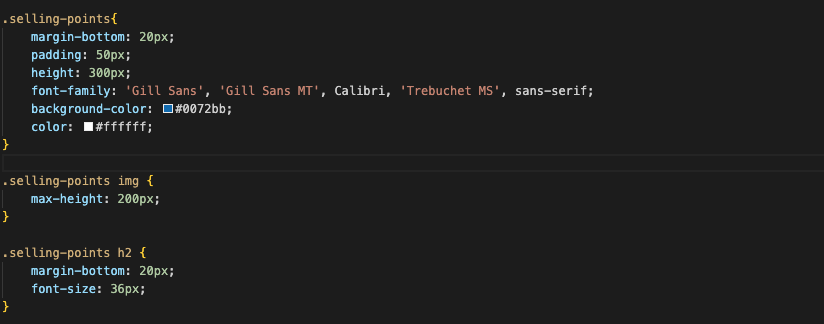

# Bootcamp Challenge 1 - Shawn Robinson  

## **Description**

For Challenge 1, the following User Story and Acceptance Criteria was provided: 

#### **User Story** 
- AS A marketing agency
- I WANT a codebase that follows accessibility standards
- SO THAT our own site is optimized for search engines

#### **Acceptance Criteria** 
- GIVEN a webpage meets accessibility standards:

- WHEN I view the source code
- THEN I find semantic HTML elements

- WHEN I view the structure of the HTML elements
- THEN I find that the elements follow a logical structure independent of styling and positioning

- WHEN I view the icon and image elements
- THEN I find accessible alt attributes

- WHEN I view the heading attributes
- THEN they fall in sequential order

- WHEN I view the title element
- THEN I find a concise, descriptive title

To accomplish this, the following changes were made to the given site: 
1. I added semantic `<section>`, `<header>`, `<footer>`, and `<figure>` tags.
2. I refactored the CSS page to consolidate several redundant classes together into `.selling-points` and `.benefits`
3. I added alt text for all images on the site 
4. I resized the footer heading size so the headings would fall in sequential order. 
5. I restructured the HTML page to better accommodate the new CSS classes and semantic tags. 

Here are some screenshots of the CSS changes: 

## Credits

All image assets --except for the two screenshots above-- and base code were provided by KU Coding Bootcamp and EdX. 

## License

MIT License

Copyright (c) 2023 shawnbradyrobinson

Permission is hereby granted, free of charge, to any person obtaining a copy
of this software and associated documentation files (the "Software"), to deal
in the Software without restriction, including without limitation the rights
to use, copy, modify, merge, publish, distribute, sublicense, and/or sell
copies of the Software, and to permit persons to whom the Software is
furnished to do so, subject to the following conditions:

The above copyright notice and this permission notice shall be included in all
copies or substantial portions of the Software.

THE SOFTWARE IS PROVIDED "AS IS", WITHOUT WARRANTY OF ANY KIND, EXPRESS OR
IMPLIED, INCLUDING BUT NOT LIMITED TO THE WARRANTIES OF MERCHANTABILITY,
FITNESS FOR A PARTICULAR PURPOSE AND NONINFRINGEMENT. IN NO EVENT SHALL THE
AUTHORS OR COPYRIGHT HOLDERS BE LIABLE FOR ANY CLAIM, DAMAGES OR OTHER
LIABILITY, WHETHER IN AN ACTION OF CONTRACT, TORT OR OTHERWISE, ARISING FROM,
OUT OF OR IN CONNECTION WITH THE SOFTWARE OR THE USE OR OTHER DEALINGS IN THE
SOFTWARE.

---
